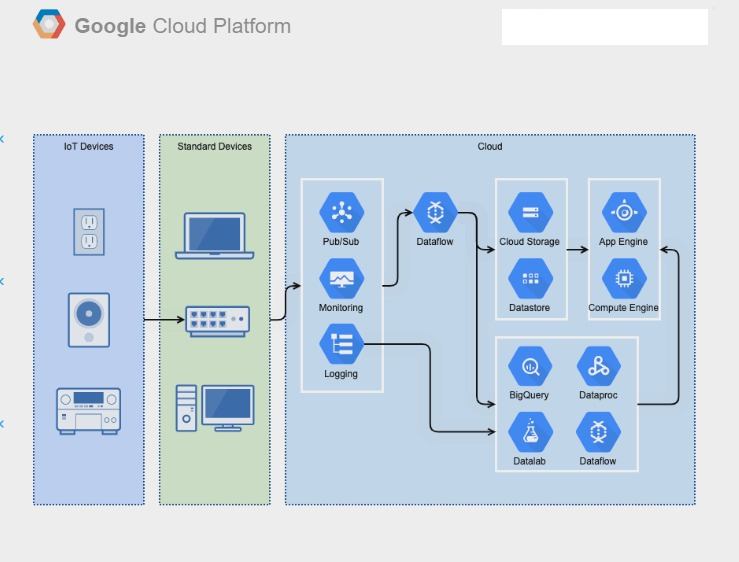

# Chapter 1

## A quick tour for GCP Console

# Lab Details:

1. The Agenda of this GCP Lab is to Practice Logging into the GCP Console. Once Logged in, You can navigate  through the GCP Console to get yourself familiarized with the GCP Console. By the End of the Lab, you will understand how the GCP Console looks, Understand how you can serach various GCP services, and undersatnd various GCP resource locations and how they are categorized. 

2. Duration: **15 minutes.**

3. Region: **Us-Central1.**

* What is GCP Console?

1. User can create, configure and manage various cloud resources such as Virtual Machines (Google Compute Engine Instances), Storage Buckets (Google Cloud Storage), Databases (Google Cloud SQL, Cloud Firestore, etc) and more.

2. The console offers monitoring and logging tools that allow users to monitor the performance, health and utilization of their resources. it also provides access to logs and metrics to troubleshoot issues.

3. Users can deploy applications and services easily and scale resources up or down based on demand using features like Google Kubernetes Engine for container orchestration.

4. The GCP console provides tools to manage access control, setup firewalls, and implement security policies to ensure the protection of resources and data.

5. Users can track and manage their usage and costs, set budgets, and view billing information to optimize their spending on cloud services.

* Architecture Diagram:

* What is Google Cloud Shell?

""." Cloud Shell is a Debian-based VM with 5 GB of free persistent disk storage that provides you with command-line access to your cloud resources directly from the browser.
 

