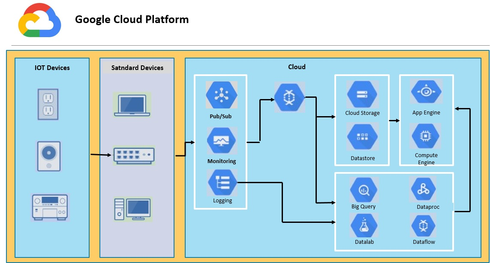
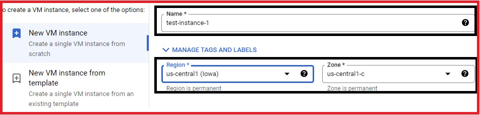
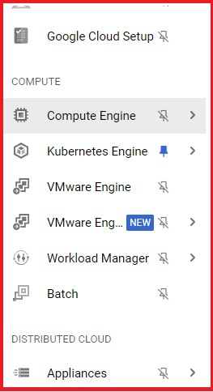
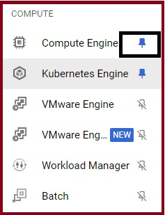
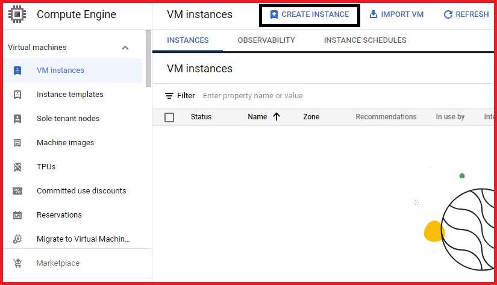

# Chapter 1

## 1. A quick tour for GCP Console

### Lab Details:

  1. The Agenda of this GCP Lab is to Practice Logging into the GCP Console. Once Logged in, You can navigate  through the GCP Console to get yourself familiarized with the GCP Console. By the End of the Lab, you will understand how the GCP Console looks, Understand how you can serach various GCP services, and undersatnd various GCP resource locations and how they are categorized. 

  2. Region: **Us-Central1.**

### What is GCP Console?

  * User can create, configure and manage various cloud resources such as Virtual Machines (Google Compute Engine Instances), Storage Buckets (Google Cloud Storage), Databases (Google Cloud SQL, Cloud Firestore, etc) and more.

  * The console offers monitoring and logging tools that allow users to monitor the performance, health and utilization of their resources. it also provides access to logs and metrics to troubleshoot issues.

  * Users can deploy applications and services easily and scale resources up or down based on demand using features like Google Kubernetes Engine for container orchestration.

  * The GCP console provides tools to manage access control, setup firewalls, and implement security policies to ensure the protection of resources and data.

  * Users can track and manage their usage and costs, set budgets, and view billing information to optimize their spending on cloud services.

### Architecture Diagram:

   

### Lab Tasks:

  1. Login to GCP Console.

  2. Since it is a tour, Navigate around to see the GCP Console.

  3. Search for different GCP Services.

  4. Understand the navigation inside GCP console properly.

### Launching Lab Environment:

  1. Google Cloud Platform is a suite of Cloud Services hosted On Google's Infrastructure. From Computing and Storage to database, Machine Learning, and Networking, Google Cloud provides a huge variety of services snd APIs that can be easily integrated with multi-cloud environments applications or projects. when you log in, you will see your project home page.

  2. Once Logged into GCP Console, look around to see and get the feel of the console.

  3. Click on the hamburger icon on the top left corner.  

  4. Here you will find the list of Common GCP Services, you can scroll down and click on more products to see more services. 

  

  5. In the left sidebar, Navigate to the different GCP Services. This lab is just for navigation, You won't be able to create any resources.

  

  6. Navigate around to see all the features available. You will not have access to any resources in this lab.

### To pin/unpin a frequently used service:

 1. Click on the unpin icon as a few common services are already pinned. 

     

  2. In the left sidebar, scroll down and click on more products.

  

  3. Click on the Pin icon on any service as shown in the example.

  

### Validate the Lab:

  1. Navigate Back to the Lab Document, and click on the **Validation** button from the right sidebar.


  2. Click on **Validate My Lab** button.


  


  3. You will see the successful validation result "Lab Tasks Completed".


### Completion and conclusion:


  1. You have now successfully logged into GCP Console.


  2. You have navigated around in GCP Console and understand the features available.

### End Lab:

  1. You have successfully completed the lab.

  2. Once you have completed the steps click on the **End Lab** button from your GCP Dashboard.

## 2. Creating your first GCP VM:

### Lab Details:

  1. This lab walks you through GCP Compute Engine VM Instance Creation. 

  2. You will be creating a Ubuntu OS with GUI Mode.

  3. Region: Us-Central1

### What is a GCP Compute Engine?

  * GCP VM is an IaaS (Infrastructure as a Service). All you have got to make and put together your own VM Instances. You have complete control over the VMs instances and the runtime. GCP Compute Engine is the easiest way to use Google's Data Centers virtually. You have direct access to the packages and you put all the packages that you simply need, which is typically a web server, Database etc.

  * A Compute Engine is comparable to a Virtual PC, where you would deploy a small website plus the database
and then setup the DNS yourself.

  * GCE Instances are the most customizable unit there and thus should only be used when your application can't run on any other GCPS Services. Most of the time people use GCE to transfer their On-Prem applications to GCP since it requires minimal changes.

  * Compute Engine offers a set of predefined machine types and custom machine types also so that you can use it while creating an instance. A predefined machine type has a defined number of VCPUs and amount of memory, where as in a custom machine type you can choose a number of VCPUs and memory.

  * The only drawbacks is that you have to manage your app and VMs yourself including control of installed Disk Drives.

### Advantages: 

  * Easy to Ramp up. There is no need to ramp up on kubernetes or App Engine.

  * Complete control- You can leverage many compute engine features directly and install the software packages of your need.

  * No need for public IPs.

### Disadvantages:

  * Mostly do it yourself, which can be challenging, Although you can reuse solutions, sometimes lack experience may lead to a security breach.

### Architecture Diagram:

  

### Lab Tasks:

  1. Login into the GCP Console.

  2. Creating a VM Instance.

  3. SSH into the instance.

  4. RDP to GUI Mode.

### Launching Lab Environment:

### Creating a VM Instance:

  1. Click on the hamburger icon in the top left corner. 

  2. In the left sidebar, Click on Compute Engine. 


     


  3. On top, click on create instance. 


     

 4. Enter The Name Like Ubuntu-Instance.


     


 5. Keep the region as Us-Central1 and zone as Us-Central1-A only.
 

     


 6. In the machine configuration, choose series as N1.


     


 7. Make sure the machine type N1-Standard-1. Do not select any other option, doing so might block your access to Labs.


     


  8. Click on change under Boot Disk to choose the operating system. 


     


  9. Choose operating system as Ubuntu.


     


 10. Choose the version as the latest Ubuntu LTS with X86/64 Base.


     


 11. Choose the boot disk type as The Standard Persistent Disk.


     


 12. Keep the size as 10GB.


 13. Click on select.


 14. Under Identity and API access choose no service account from the Drop-Down Menu.


      


 15. Click on create.


 16. Now, your instance is Up and Running. Click on SSH.


      


 17. A new window will open where you can type in these commands.

 18. Enter the below command to update all the libraries.

 ```bash
 sudo apt-get update 
 ```

 19. Enter the below command to install the RDP configurations.

 ```bash
 sudo apt-get install xrdp
 ```

 20. If prompted to confirm, Press Y and then press Enter.


 21. Enter the below command to install the GUI Mode.

 ```bash
 sudo apt-get install xfce4
 ```

 22. If prompted to confirm, Press Y and then Press Enter.

 23. Enter the below command to restart the RDP Service.  

 ```bash
 sudo service xrdp restart
 ```

 24. Enter the below command to switch to the root user.

 ```bash
 sudo -s
 ```

 25. Enter the below command to configure the password.

 ```bash
 passwd
 ```

 26. Choose any password, later you will need this password to login into the VM.

       **Enter new Unix password**

 27. Retype to confirm your password.  **Retype new Unix password** 

 28. The Password is updated successfully.

       


   ### Validate the Lab:


   1. Navigate back to the Lab Document, and click on the **validation** button from the right sidebar.

   2. Click nn **validate My Lab** Button.

   3. You will see the successful validation result **"Lab Tasks Completed"**
   .

   ### RDP into the Instance: 


    For MAC Users -> Please go through RDP Into Instance For Mac Users.

    For Windows Users -> Please go through RDP Into Instance For Windows Users.

    For Other OS Users -> Download any RDP client and follow any of the above documents similarly.


   ### Completion and Conclusion:


    1. In this Lab, You have created an N1 series VM Instance with machine type **'N1-Standard-1'**.

    2. You have done SSH into instance and installed tools like **RDP and XFCE4**

    3. You have set a Password for your instance.

    4. You have done RDP into the instance.


   ### End Lab:


    1. You have successfully completed the Lab.

    2. Once you have completed the steps click on the **End Lab** button from the dashboard.


## 3. Google Cloud CLI Commands using Cloud Shell 

### Lab Details:

 1. This lab walks you through Google Cloud CLI Commands using Cloud Shell.

 2. You will be creating a VM instance and VPC network using CloudShell. 

### Lab Overview:

 * Cloud Shell is Debian-based VM with 5 GB of free persistent disk storage that provides you with the command line access to your Cloud resourecs directly from your browser.

 * You can easily manage your projects and resources without having to install Cloud SDK on your system.

 * Gcloud is the command line interface to interact with most of the GCP services which are preinstalled in Cloudshell. By using Gcloud you can talk to compute Engine VMs, Managed Instance Groups, Create a database, and so on.

 * Some Google Cloud Services have specific CLI tools for accessing the particular service.

  * Cloud Storage - gsutil 
  * Big Query - bq
  * Cloud Bigtable - cbt
  * Kubernetes(for managing pods and deployments)- Kubectl

 * Basically, you can use Cloudshell to interact with GCP service via CLI.

### Architecture Diagram:


### Lab Tasks:

  1. Login into the GCP Console

  2. Opening and exploring Cloudshell

  3. Creating a VPC using Cloud Shell

  4. Creating a VM instance using Cloudshell

  5. SSH into the VM instance

### Launching Lab Environment:

 1. Launch the lab environment by clicking on the **start Lab** button from the right sidebar. This will create a GCP environment with the resourcesand rolesrequired for the lab. 

 2. Once the lab environment is ready, the **Open Console** button will be active. Click on the **Open Console** button, this will open Google Sign-in page. (Make sure you are using **Incognito Mode**).

 3. Navigate back to Lab document, You will see **Lab Credentials**, Copy the credentials to sign-in to the console from the highlighted Email and password using Copy button.

## 4. Types of IP Addressing in GCP:

### What is an IP Address:

 * Just walk you Vehicle number gives you an identity to drive your car on roads similarly, IP gives you an identity in the Internet world. IP is an Internet Protocol.

 * The IP address assigned to your computer by your ISP. Since they are the ones giving you access to the internet, It's their role to assign an IP address to your computer. Your internet activity goes through them, and they route it back to you, using your IP Address.

 * IP's are not permanent or physically engraved on your device, it's just a software term. IP may get changed if ISP wants. There are the permanent addresses and are reffered to as MAC(Media Acces Control) Addresses.

### Types of IP Addresses:


### External IP Addresses: 

 * An **External IP Address** is an address assigned to you by your ISP. It is the address through which the internet and other computers outside your local network use to identify you. You can also often type "IP Address" into search engines such as Google to see your IP Address.

### Internal IP Addresses:

 * The **Internal IP Address** is the address that is assigned by your local network router. It generally begins with 192.168.x.x. It is also known as Local Ip Address. These IP Addresses are only seen by other computers in your local network and not by local computers connected  to an external network, Such as the Internet. To know about your Internal IP Address, Open the terminal/command prompt, Search ipconfig and press Enter.

### Ephemeral External/Internal IP Addresses:

 * Ephemeral means "changing" the thing that keeps on changing. Ephemeral External/Internal IP in GCP means the IP that is not fixed and keeps on changing. The IP would not change in the middle of the process, while the creation of VM instance, a particular IP is assigned (ephemeral IP by default) to it, when we stop/suspend that VM for that very moment, Google assing that ip to some other VM instance and later when you restart your VM instance, it will be alloted with a different IP Address. The advantages of using emphemeral IP are that is not costly, you don't have to pay for the IP separately, the cost is included with the VM lifecycle only and the disadvantages of using it is that if your IPs are hardcoded somwhere and you have various dependencies among the services, then often changing of IP will be an overhead for operational time and cost.

### Static External IP/Internal IP addresses:

 * Static means "Permanent". Static External/Internal IP in GCP means the IP that is fixed for a particular resource. While the creation of a VM instance, a particular IP is assigned (ephemeral IP by default) to it, for static IP you have to reserve an IP from VPC networks and then assign it to the VM instance during the creation. There is no effect of stopping/suspending the VM on the static IP. The advantages of using static IP are that IP never gets changed unlike the Ephemeral, so there is no effect of infrastructural dependencies and the disadvantage of using it is that it is not expensive, you have to pay for the IP seperately, even if it's not being used.

### Lab Tasks:

 1. Creating a VM instance with an Ephereal IP address.

 2. Reserving a Static External IP.

 3. Creating a VM instance with a Static External IP address.

### Launching Lab Environment:

 1. Launch the lab environment by clicking on the **Start Lab** button from the right sidebar. This will create a GCP environment with the resources and roles required for this lab.

 2. Once the lab environment is ready, the **Open Console** button will be active. Click on the **Open Console** button, this will open Google sign-in page. (Make sure you are using an **Incognito Mode**).

 3. Navigate back to Lab Document, you will see **Lab Credentials**, copy the credentials, copy the credentials to sigh-in to the console from the highlighted Email and Password using Copy Button.

## 5. Mount a Persistent Disk on a VM

### Lab Details:

 * This lab walks you through mounting a Persistent Disk onto a VM.

### What is a Persistent Disk?

 * Compute Engine provides several different types of storage options that you can choose while creating an instance.

 * Persistent Disks are durable network storage devices available for your instances, and you can access them like a physical sidk on a desktop.

 * Persistent Disks are independent of your VM instances. Persistent disk performance scales automatically, so you can resize your existing persistent disks or add more persistent disks to an instance to meet your performance and space requirements.

 * Disks can be categorized as Data Disk and boot disk. You can choose to have a Zonal or Regional disk type. As the name specifies Zonal persistent disks have disks available in a single Zone. Still, Regional disks offer durable storage and redundancy of data between two zones in the same region.

### Google Cloud offers 4 types of disk:

 1. Standard Persistent Disks (pd-standard)

 2. Balanced Persistent Disks (pd-balanced)

 3. SSD Persistent Disks (pd-ssd)

 4. Extreme Persistent Disks (pd-extreme)

### Why to Mount PD on VM:

 1. Change the type of the Disk.

 2. Increase the size and performance of the current Filesystem.

 3. Add a backup persistent disk to the VM.

### Lab Tasks:

 1. Create a VM.

 2. Create and attach a Data Persistent Disk to the VM.

 3. Format and mount the disk onto the VM.

### Launching Lab Environment:

 1. Launch the lab environment by clicking on the **Start Lab** button from the right sidewar. This will create a GCP environment with the resources and roles required for this lab.

 2. Once the lab environment is ready, the **Open Console** button will be active. Click on **Open Console** button, this will open Google Sign-in page. (Make sure you are using an **Incognito Mode**).

 3. Navigate back to Lab document, you will see **Lab Credentials**, copy the credentials to Sign-In to the console from the highlighted Email and Password using Copy button.

## 6. Using Startup and Shutdown Scripts in Compute Engine:

### Lab Details:

 1. This lab walks you through how to use Startup and Shutdown Scripts with Google Compute Engine.

 2. Region: us-central1

### What is a GCP Compute Engine?

 * GCP VM is an infrastructure as a Service (IaaS). All you've got to make and put together your own VM instances. GCE provides you with full infrastruture with a variety of VMs. You have complete control over the VMs' instances and the runtime. Actually, GCP Compute Engine is the easiest way to use Google's data centers virtually.

 * Simply, A Compute Engine is comparable to a virtual PC, where you would deploy a small website plus the database and then set up the DNS yourself.

 * GCE instances are the most customized unit there and thus should only be used when your application can't run on any other GCP services. Most of the time people use GCE to transfer their On-Prem applications to GCP since it requires minimal changes.

 * Compute Engine offers a set of predefined machine types and custom machine types also so that you can use them while creating an instance. A predefined machine type has a defined number of vCPUs and amount of memory, whereas, in a custom machine type, you can choose a number of vCPUs and memory.

### What is Startup Scripts?

 * A Startup Scripts in Google Cloud Compute Engine is a script that is automatically run when a VM instance start up.

 * The Script can perform various tasks such as a installing software, configuring the system, or starting services.

 * Startup Script can be added to an instance through the Cloud Console, **gcloud** command-line tool, or the API.

 * They are typically written in bash, but can also be written in other srcipting languages.

### What is Shutdown Scripts?

 * A Shutdown Script in Google Cloud Compute Engine is a script that is automatically run when a VM instance is Shutdown. 

 * The Script can perform various tasks such as saving data, stopping services, or cleaning up the system.

 * Shutdown Scripts can be added to an instance through the Cloud Console, **gcloud** command-line tool, or the API.

 * They are typically written in Bash, but can also be written in other sripting languages.

 * It is important to note that the Shutdown Script runs only when the instance is being shut down and not terminated.

### Lab Tasks:

 1. Login into the GCP Console.

 2. Creating a VM instance using Startup and Shutdown Scripts.

 3. Testing the Startup and Shutdown Scripts.

### Launching Lab Environment:

 1. Launch the lab environment by clicking on the **Start Lab** button from the right sidebar. This will create a GCP environment for this Lab.

 2. Once the lab environment is ready, the **Open Console** button will be active. Click on the **Open Console** button, this will open Google Sign-In page. (Make sure you are using an **Incognito Mode**).

 3. Navigate back to Lab Document, you will see **Lab Credentials**, copy the credentials to Sign-in to the console from the highlighted Email and password using Copy Button.


