# Chapter 1

## 1. A quick tour for GCP Console

  * The Agenda of this GCP Lab is to Practice Logging into the GCP Console. Once Logged in, You can navigate  through the GCP Console to get yourself familiarized with the GCP Console. By the End of the Lab, you will understand how the GCP Console looks, Understand how you can serach various GCP services, and undersatnd various GCP resource locations and how they are categorized.   
  
  ### What is GCP Console?

   * User can create, configure and manage various cloud resources such as Virtual Machines (Google Compute Engine Instances), Storage Buckets (Google Cloud Storage), Databases (Google Cloud SQL, Cloud Firestore, etc) and more.

   * The console offers monitoring and logging tools that allow users to monitor the performance, health and utilization of their resources. it also provides access to logs and metrics to troubleshoot issues.

   * Users can deploy applications and services easily and scale resources up or down based on demand using features like Google Kubernetes Engine for container orchestration.

   * The GCP console provides tools to manage access control, setup firewalls, and implement security policies to ensure the protection of resources and data.

   * Users can track and manage their usage and costs, set budgets, and view billing information to optimize their spending on cloud services.


  ### GCP Console Lab:

   1. When You Log In, You Will See Your Project Home Page.

   2. Once Logged Into GCP Console, Look Around To See And Get The Feel Of The Console.

   3. Click On The Hamburger Icon On The Top Left Corner.  

   4. Here You Will Find The List Of Common GCP Services, You Can Scroll Down And Click On More Products To see More Services.  

  


   5. In The Left Sidebar, Navigate To The Different GCP Services.


  


  ### To pin/unpin a frequently used service:
   
   1. Click On The Unpin Icon As A Few Common Services Are Already Pinned. 


   


   2. Click On The Pin Icon On Any Service As Shown In The Example.

      
   


  ### End Lab:

  * You have successfully completed the lab.

  * Once you have completed the steps click on the **End Lab** Button from your GCP Dashboard.


## 2. Creating your first GCP VM:  

  ### Creating a VM Instance:
 
   1. In the Left Sidebar, Click on **Compute Engine** and then click on **Create Instance**.

    
  


   2. Enter the name like **test-instance-1** and select the **Region** and **Zone** (As per your requirement).


  


   3. In the Machine Configuration, Choose series as **N1** (As per your requirement).


   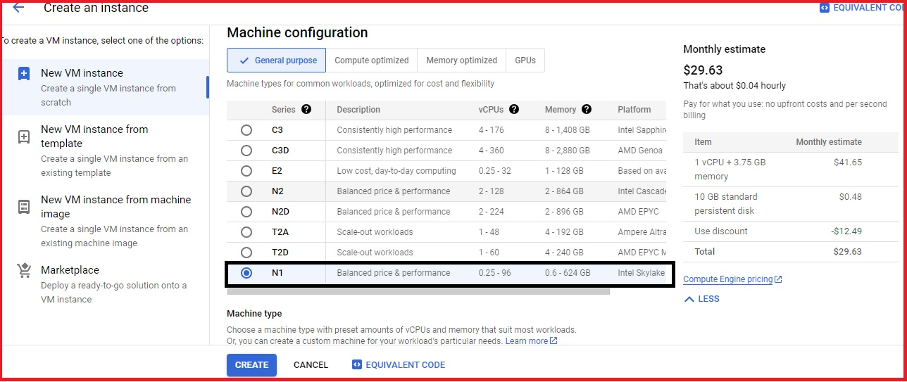


   4. In Machine Type, There are two Options, **PRESET** (By default select CPU and Memory) and **CUSTOM** (You can upgrade and downgrade CPU and Memory as per your requirement).


   


   5. Click on change under Boot Disk to **CHANGE** and choose the **Operating System** (As per your requirement).


   


   


   


   6. Click on **SELECT**

   7. Under **Identity and API access** choose No Service Account from the Drop-Down menu.


  


   8. Click on **CREATE**.

   9. Now, Your instance is up and running. Click on SSH.


  


   10. A new window will open where you can type in these commands.

   11. Enter the below command to update all the libraries. 

   ```bash
   sudo apt-get update
   ```

   


   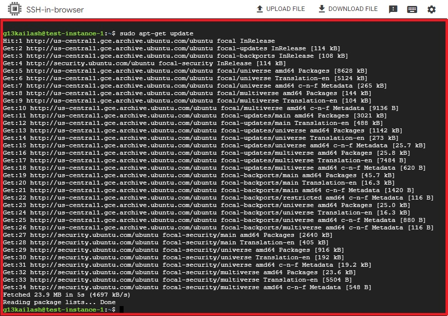


   12. Enter the below command to install the RDP configurations.

   ```bash
   sudo apt-get install xrdp
   ```

  

   13. If prompted to confirm, press **Y** and then press **Enter**.

   14. Enter the below command to install the GUI Mode.

   ```bash
   sudo apt-get install xfce4
   ```

  


  


   15. Enter the below command to restart the RDP service.

   ```bash
   sudo service xrdp restart 
   ```

  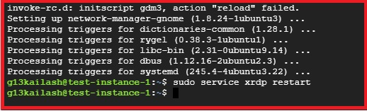


   16. Enter the below command to switch to The Root User.

   ```bash
   sudo -s
   ```

  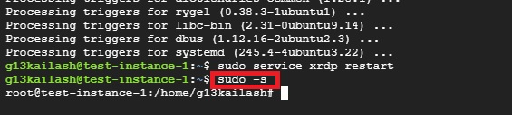


   17. Enter the below command to configure the Password.

   ```bash
   passwd
   ```

  


   18. After Successfully completion of Lab, we have to delete the Instance. Click on the **Kebab** select **Delete** option.


  


   19.  End Lab:


   * You have successfully completed the **Lab** .


## 3. Google Cloud CLI commands using Cloud Shell:

 ### Sign in to GCP Console:

  1. After login to GCP Console, Click on the **Activate Cloud Shell** Button at top right corner of Dashboard.


  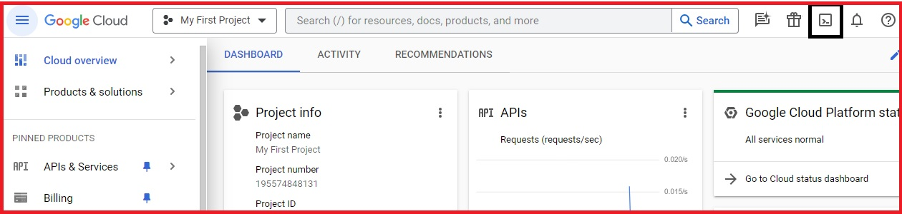


  2. Click on the **CONTINUE** Button


  


  


  3. Now you are in the CloudShell Environment to interact with GCP services. Before proceeding further enter the below command to set your project. You can copy the project id from the lab document.


  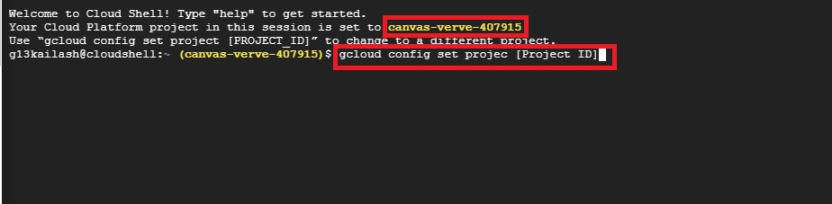


  ### Creating a VPC network using CloudShell: 

   1. In the CloudShell run the below command to create a Custom VPC network. After run this command, Click on **AUTHORIZED** button.

   ```bash
   gcloud compute networks create clivpc --subnet-mode=custom
   ```


   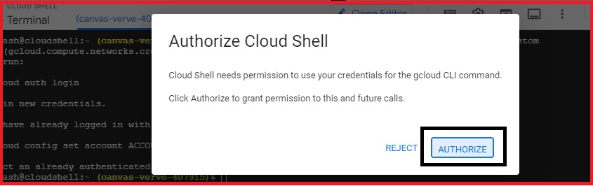


   2. You will get the below output stating as the VPC network has been created.


  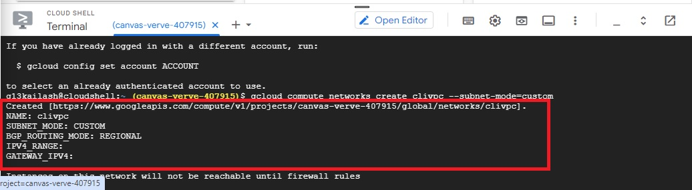


   3. To create a subnet under the above VPC network in the us-central1 region. Enter the below command.

  ```bash
  gcloud compute networks subnets create clisubnet1 --network=clivpc --range=10.0.2.0/29 --region=us-central1
  ```

  


  4. To allow or deny traffic you need to create a Firewall rule under the VPC network. Enter the below command to create a firewall rule.

  ```bash
  gcloud compute firewall-rules create cli-firewall --network clivpc --allow tcp:22,icmp
  ```


  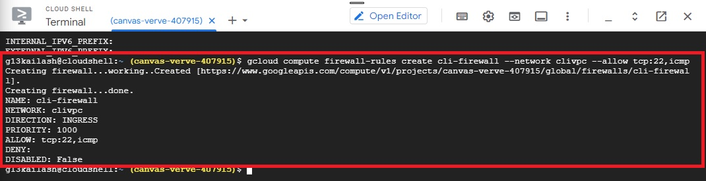


  
  ### Creating a Instance using Cloud Shell:

  1. Enter the below command to create a Compute Engine instance with the created subnet network. By default, it will create a machine-type family as n1-standard-1.

  ```bash
  gcloud compute instances create cli-vm --subnet clisubnet1 --zone us-central1-a --no-scopes --no-service-account
  ```

  2. You will get the below output for the created VM instance with an external IP address.


  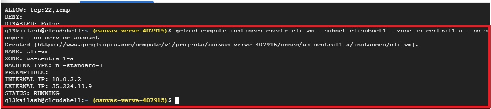


 ### SSH into the VM instance: 

 1. Click on the hamburger icon in the top left corner. 

 2. In the left sidebar, click on Compute Engine.

 3. You will see VM Instance that you have created recently. Click on the SSH button to **SSH** into the instance.


 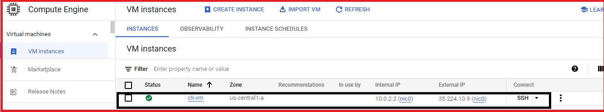


 4. A new window will open, enter the below command and press Enter.

 ```bash
 gcloud auth login --no-launch-browser -q
 ```

 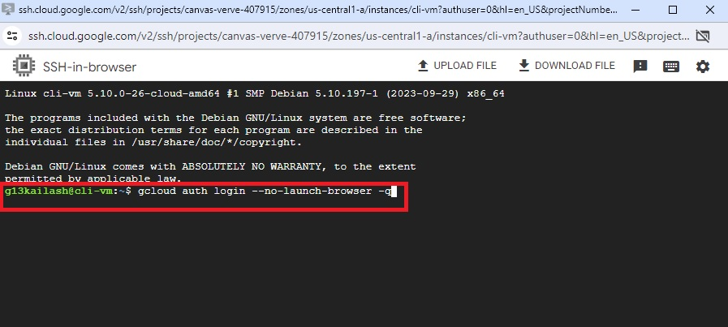


 5. You will receive below as the output. Copy the URL mentioned in the output.


 


 6. Paste the URL in a new tab and log in with the Email ID mentioned in the login console. And After the successful login, you will be prompted to give access to Google Cloud SDK, click on **Allow**.


 


 7. You will receive an Authorization code as the output, copy the code and switch back to the SSH window.


 


 8. Enter the Code and click Enter.


 


 9. You will receive below as the output.


 


 10. Enter the below command to get the latest update in this operating system.

 ```bash
 sudo apt-get update
 ```


 


 11. Enter the below command to ping Google.com to check the internet connectivity.

 ```bash
 ping google.com
 ```


 


 12. Enter the below command to close the SSH Window.

 ```bash
 exit
 ```

 13. After Successfully completion of Lab, we have to delete the Instance. Click on the **Kebab** select **Delete** option.


 ### End Lab:


 * You have successfully completed the **Lab** .

## 4. Types of IP Addressing in GCP:

 ### Creating a VM Instance with an Ephemeral IP address:

  1. Click on the hamburger icon on the top left corner 

  2. Click on **Compute Engine** under Compute section.


  


  3. Enter the name like instance-ephemeral and Keep the **region** to **us-central1** and **Zone** as **us-central1-a**.


  


  4. Choose series as **N1**, under Machine Configuration and Choose the machine type as **n1-standard-1**.


   


  5. Under **Identity and API access** choose **No service Account** from the drop-down menu.


   


  6. Leave other settings as default and click on Create.

  7. After the successful creation of the VM, you will see the below as the output. Note down the **Internal IP (10.128.0.3)** and the **External IP (35.225.12.241)**.


   


  8. Click on the **kebab** icon under the **ephemeral-instance** instance. 


   


   9. Click on **Stop** to stop the running VM, in order to see the change in IP address.


   


   10. Click on **Stop** from the pop-up window.


   


   11. It will take a few minutes for the VM to get stopped. You will see the below as the output after VM is stopped. Now click on the **Kebab** icon to start the VM again.  


   


   12. Click on **Start/Resume** to start the VM.


  


   13. After the successful starting of the VM, you will see the below as the output. Note down the **Internal IP (10.128.0.3)** and the **External IP (35.202.207.57)**.


  


 ### Reserving a Static External IP:

  1. Click on the hamburger icon on the top left corner 

  2. Click on the **VPC network** and Click on **IP addresses** from the left panel.


   


  3. Click on **Reserve External Static Address** to reserve/create the Static IP.


  


  4. Enter the name and Leave other settings as it is and click on Reserve.


  


  5. After reserving the IP, the output should look like the below. (Below IP and your static IP will differ).


  


  ### Creating a VM Instance with a Static IP address:

   1. Click on **Compute Engine** and then Click on **CREATE INSTANCE** and set the below settings.


  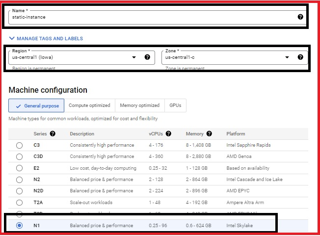


  


  2. Under ** Advance Options** click on **Networking**.


   


  3. Under **Network Interfaces** click on the **default network**.


   


  4. Under the **External IPv4 address** choose the one you just created above i.e. **static-kailash** and leave other settings as default and then Click on **CREATE**.


   


  5. After the successful creation of the VM with a static IP, you can see below as the output. Note down the **Internal IP (10.128.0.4)** and the **External IP (35.184.18.19)**.


   


  6. Click on the **kebab** icon under the instance-staic instance and Click on **Stop** to stop the running VM, in order to see the change in IP address. 

   
  


  


  7. It will take a few minutes for the VM to get stopped. You will see the below as the output after VM is stopped. Now click on the **Kebab** icon to start the VM again.


  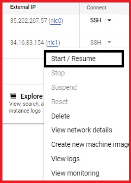


  8. After the successful starting of the VM, you will see the below as the output. Note down the **Internal IP (10.128.0.4)** and the **External IP (35.225.12.241).


  


  9. We have successfully differentiated between static and ephemeral IPs.

  10. After Successfully completion of Lab, we have to delete the Instance. Click on the **Kebab** select **Delete** option.


  


  11. Now Prompt will come for Deletion the Instance. Click on **Delete** to permanently deletion of Instance.


  


  12. Now you can check the status as per below image, there is no any Instances are available.


  

  
 **End Lab**

  You have successfully completed the **LAB**


## 5. Mount a Persistent Disk on a VM:

 ### Creating a VM and Mounting the Disk on it:

  1. Click on the hamburger icon on the top left corner. 

  2. Click on **Compute Engine** under the Compute Section.


   


  3. Click on Create Instance from the top panel.


   


  4. Enter the name of the VM **(mount-vm)** and Choose the **Region** as **us-central1(lowa)** and **Zone** as **us-central1-a**.


   


  5. Under **Machine Configuration** choose Series as **N1** and Machine Type as **n1-standard-1**.


   


  6. Under **Identity and API access** choose **No service Account** from the drop-down menu.  


   


  7. Leave the rest of the settings as default and click on Create.

  8. Click on the **Cloud Shell** icon in the top right corner as shown below.

    
   


  9. Use the below command to create a new disk with the name **data-disk** in the **us-central1-a** zone.

   ```bash
   gcloud compute disks create data-disk \ --zone=us-central1-a \ --size=10GB \ --type=pd-standard
   ```

  10. Click on **AUTHORIZE**


   

  
   


  11. Now attach the disk with the instance. Replace <INSTANCE-NAME> with the name of the VM you created above i.e. **mount-instance**. 
  
   ```bash
   gcloud compute instances attach-disk <mount-instance> \ --disk data-disk \ --zone=us-central1-a 
   ```

   
   
  12. Click on the **SSH** button under the Connect section of your **mount-vm** virtual machine.  


   


   


  13. Enter the below command and press Enter.
 
   ```bash
   gcloud auth login --no-launch-browser -q
   ```
  
  14. You will receive below as the output. Copy the URL mentioned in the output. 


  


  15. Paste the URL in a new tab and login with the Email ID mentioned in the login console.

   
   


  16. After the successful login, you will be prompted to give access to Google Cloud SDK, click on Allow.


   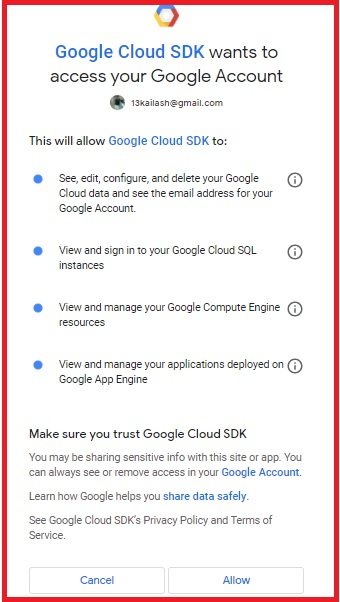


  17. You will receive an Authorization code as the output, copy the code and switch back to the SSH window.


   


  18. Enter the **Code** and click **Enter** You will receive below as the output.


   


  19. Use the below command to list the Disk available.

   ```bash
   sudo lsblk
   ```


  20. You will receive something like the below as the output. Here **sdb** is the disk you want to mount to the VM i.e the one you created above.


   


  21. Now, let's format the disk and make sure the disk is empty. We are using **mkfs** here which is a hard disk partitioning system for Linux. Here **-m** defines the reserved blocks percentage, **-F** forces mkfs to create a File system, **-E laz_itable_init=0,lazy_journal_init=0,discard** speeds up the filesystem initialization. **/dev/sdb** is the path to the Disk that we want to mount.

  ```bash
  sudo mkfs.ext4 -m 0 -F -E lazy_itable_init=0,lazy_journal_init=0,discard /dev/sdb
  ```

  22. You will receive the below as the output.  


   


  23. Now, let's create a **Mount directory** that will act as a Point to attach to the VM. Here the path is **/data-mount/test**.

  ```bash
  sudo mkdir -p /data-mount/test
  ```

  24. After Formatting and creating the directory, now mount the disk on the VM using the below command.

   ```bash
   sudo mount -o discard,defaults /dev/sdb /data-mount/test
   ```

  25. Run the below command to get the list of the disk.

   ```bash
   lsblk
   ```

  26. You will have the below as the output, have a look at the path of the Mountpoint, it looks different from the Mountpoint as in Step20.

   


  27. The Disk is mounted, but in order to make it functional, we need to assign it the read and write permissions.

   ```bash
   sudo chmod a+w /data-mount/test
   ```

  28. Confirm the mounting of PD to the VM using the below command.

   ```bash
   df -h
   ```

  29. You will see below as the output. Observe the **/dev/sdb** and its attributes such as **Used, Use%**.

   
   


  30. Go back to the Google Cloud Console and click on the Virtual Machine that you created i.e. **mount-vm**.


   


  31. Scroll down and you will observe that a data disk is added to the VM with the name **data-disk** with Mode as **R/W**.

   
   


  31. **Delete** the **Instance** and **Additional Data Disk** After completed the lab successfully.
       
      Click on **Action** button and select **Delete**.


   


    **END LAB**
    

    You have successfully completed the **LAB** .

   

## 6. Using Startup and Shut Down Scripts in Compute Engine:

 ### Creating a VM Instance using Startup and Shutdown Scripts:

  1. In the left sidebar, click on **Compute Engine** and click on **Create Instance**.

    
  


  2. Enter the name like **test-instance** and Keep the **region** as **us-central1** and **Zone** as **us-central1-a** only.

   
  


  3. Under the Machine Configuration, choose series as **N1** and Make sure the machine type is **n1-standard-1**.


  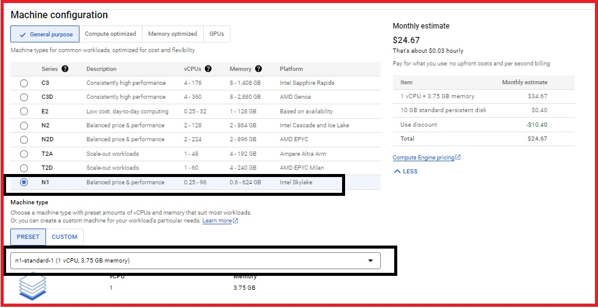


  4. Under **Identity and API access** choose **No service Account** from the drop-down menu **and** Under **Firewall**, check **Allow HTTP traffic** and **Allow HTTPS traffic**. 

    
  


  5. Click on the down arrow to expand the **Advanced Options** and Expand the **Management** tab.

    
  


  6. In the **automation** section, paste the Startup script as given below. This script will install the **Apache2 server** on it.

  ```bash
  #!/bin/bash
      apt-get update -y
      apt-get install -y apache2
      echo '<h1> Startup Script has been successfully executed </h1>' > /var/www/html/index.html
  ```


  


  7. In the **Metadata** section, Click on **ADD ITEM**.

     

  8. Enter **Key1** as **shutdown-script** and paste the **Shutdown script** as given below in the **Value1** section. This script will create a new txt file with a message.

  ```bash
  #!/bin/bash
      echo 'Shutdown Script has been successfully executed' >> /root/history.txt
  ```

  

   
  9. Keep the other options as it is. Click on **CREATE**.


  10. Wait for 1-2 minutes till your instance is up and running.

      
  


  ### Testing the **Startup and Shutdown Scripts**:

  1.  In the **VM Instances** section, **copy** the **External IP** and open a new tab with the **URL http://External_IP/**.

      
  

  2. You will receive the output below that means **Startup script has been successfully executed** without any error.

  
     

  3. In the Console, Click on **SSH** in beside the instance that you just created **test-instance**.


  


  4. In the **SSH console**, Run the below query to check if a file named as **history.txt** exists.

  ```bash
    sudo cat /root/history.txt
  ```

  5. You should get the output as below.

      
  


  6. Execute the below query to restart the VM instance.

  ```bash
     sudo reboot
  ```

  7. After executing the above query, if you get a **Connection failed** prompt, Click on **Retry**.

  
  
 

  8. After connecting to **SSH** again, Use the below query to check if the Shutdown script is executed or not.

  ```bash
    sudo cat /root/history.txt
  ```

  9. You should receive the below output that means **Shutdown script** has been successfully executed and a new file has been created named as **history.txt** that was not there earlier.


  


  10. After completion of **Lab**, Delete the Instance.


  


  **END LAB**

  You have successfully completed the **Lab** .


   


   


   


    


    


