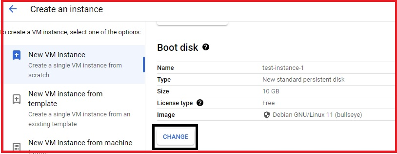
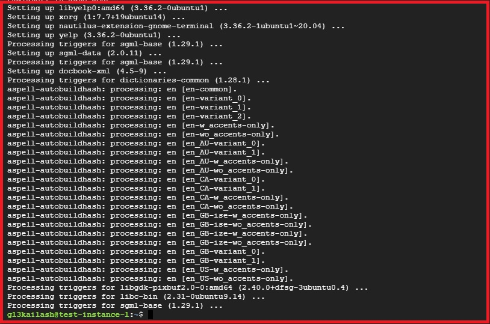

# Chapter 1

## 1. A quick tour for GCP Console

  * The Agenda of this GCP Lab is to Practice Logging into the GCP Console. Once Logged in, You can navigate  through the GCP Console to get yourself familiarized with the GCP Console. By the End of the Lab, you will understand how the GCP Console looks, Understand how you can serach various GCP services, and undersatnd various GCP resource locations and how they are categorized.   
  
  ### What is GCP Console?

   * User can create, configure and manage various cloud resources such as Virtual Machines (Google Compute Engine Instances), Storage Buckets (Google Cloud Storage), Databases (Google Cloud SQL, Cloud Firestore, etc) and more.

   * The console offers monitoring and logging tools that allow users to monitor the performance, health and utilization of their resources. it also provides access to logs and metrics to troubleshoot issues.

   * Users can deploy applications and services easily and scale resources up or down based on demand using features like Google Kubernetes Engine for container orchestration.

   * The GCP console provides tools to manage access control, setup firewalls, and implement security policies to ensure the protection of resources and data.

   * Users can track and manage their usage and costs, set budgets, and view billing information to optimize their spending on cloud services.


  ### GCP Console Lab:

   1. When You Log In, You Will See Your Project Home Page.

   2. Once Logged Into GCP Console, Look Around To See And Get The Feel Of The Console.

   3. Click On The Hamburger Icon On The Top Left Corner.  

   4. Here You Will Find The List Of Common GCP Services, You Can Scroll Down And Click On More Products To see More Services.  

  


   5. In The Left Sidebar, Navigate To The Different GCP Services.


  


  ### To pin/unpin a frequently used service:
   
   1. Click On The Unpin Icon As A Few Common Services Are Already Pinned. 


   


   2. Click On The Pin Icon On Any Service As Shown In The Example.

      
   


  ### End Lab:

  * You have successfully completed the lab.

  * Once you have completed the steps click on the **End Lab** Button from your GCP Dashboard.


## 2. Creating your first GCP VM:  

  ### Creating a VM Instance:
 
   1. In the Left Sidebar, Click on **Compute Engine** and then click on **Create Instance**.

    
  


   2. Enter the name like **test-instance-1** and select the **Region** and **Zone** (As per your requirement).


   


   3. In the Machine Configuration, Choose series as **N1** (As per your requirement).


   


   4. In Machine Type, There are two Options, **PRESET** (By default select CPU and Memory) and **CUSTOM** (You can upgrade and downgrade CPU and Memory as per your requirement).


   


   5. Click on change under Boot Disk to **CHANGE** and choose the **Operating System** (As per your requirement).


   


   


   


   6. Click on **SELECT**

   7. Under **Identity and API access** choose No Service Account from the Drop-Down menu.


  


   8. Click on **CREATE**.

   9. Now, Your instance is up and running. Click on SSH.


  


   10. A new window will open where you can type in these commands.

   11. Enter the below command to update all the libraries. 

   ```bash
   sudo apt-get update
   ```

   


   


   12. Enter the below command to install the RDP configurations.

    ```bash
    sudo apt-get install xrdp
    ```

  

   13. If prompted to confirm, press **Y** and then press **Enter**.

   14. Enter the below command to install the GUI Mode.

    ```bash
    sudo apt-get install xfce4
    ```

  


  


   15. Enter the below command to restart the RDP service.

   ```bash
   sudo service xrdp restart 
   ```

  


   16. Enter the below command to switch to The Root User.

    ```bash
    sudo -s
    ```

  


   17. Enter the below command to configure the Password.

    ```bash
    passwd
    ```

  


   18.  End Lab:

   * You have successfully completed the Lab.


    


    


