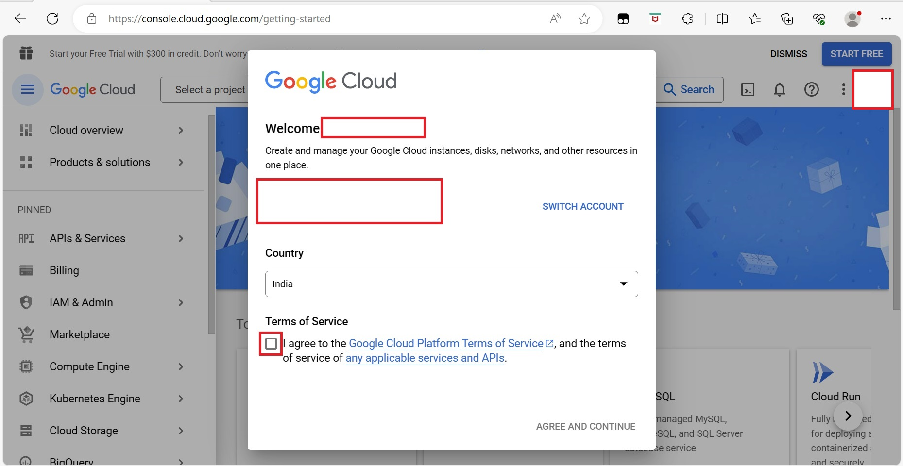
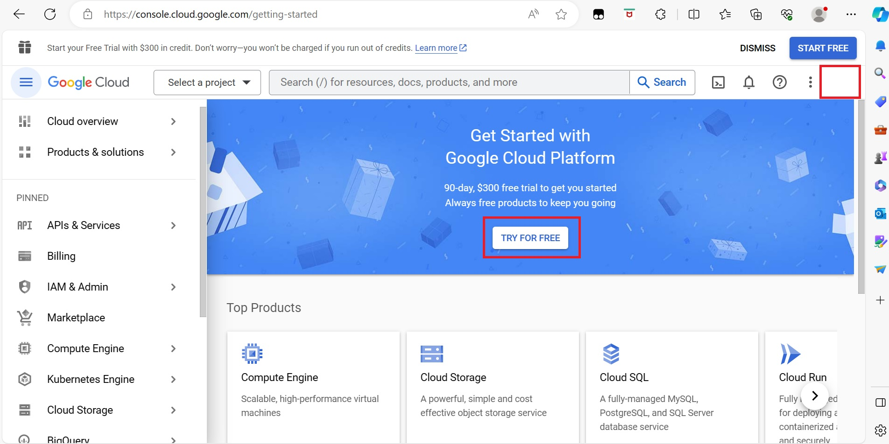
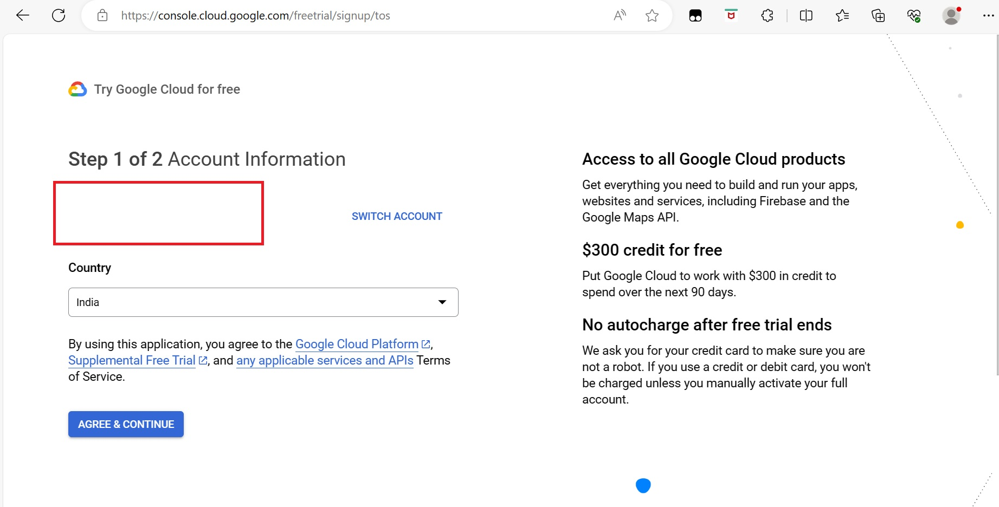
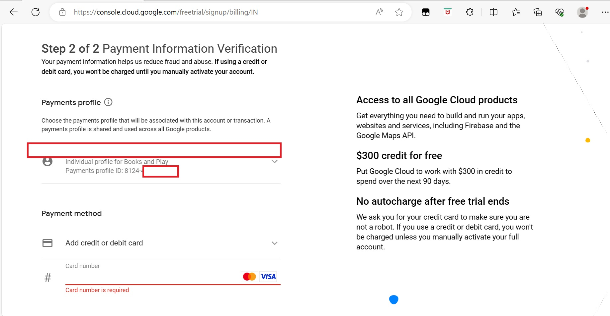

# Hands on Labs for Git Book
This section helps you create a free GCP account 
1. Navigate to console.cloud.google.com
2. Sign-in with your gcp account
3. Click **Agree** to the terms and conditions as shown below

4. On the next page click on **Try for Free** as shown below:

5. On the next page click **Agree and Continue** as shown below:

6. On the next page, you would see an Individual Payment’s Profile selected there under your name as shown below:

7. Enter your card number, scroll down and click on **start for free**